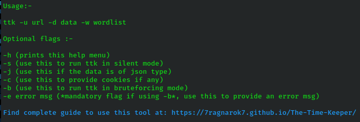

# *The-Time-Keeper (TTK)* [](https://www.gnu.org/software/bash/)
[][page]

##### TTK is a ***Universal*** Timing Attack Initiator which also adds up as a ***Password Brute-Forcing/Fuzzing*** tool.

Poorly written code in the back-end may sometime can create a delay in response based on certain conditions.
**TTK** hunts for such scenarios and compares the resonse times to figure out possible users present in the application.

Furthermore upon finding a valid username, **TTK** can also attemp to guess the password of the user by launching a brute-force attack. 

### [CODE OF CONDUCT](CODE_OF_CONDUCT.md)

### [CONTRIBUTING](CONTRIBUTING.md)

### Use case :-

The code snippet below is a great example for a poorly written back-end code which can be exploited by **TTK**. The server tries to verify the password of the user only if a correct username is provided. 
```
def login(username, password):
    if username in users: ## Checks If it's a valid username
        login_status = check_password(password) ## This takes a noticeable amount of time which creates some delay in the response
        if login_status:
            return new_session_token()
        else:
            return "Username or password incorrect"
    else:
        return "Username or password incorrect"
```
### Requirements :- 
 - [jq][jq]

 - [Termux][tm] (if installing on an android device)

 - *A bit of love and care* ^_^

### Installation :-
 - Download the latest release from [RELEASES][RELEASES]
 
 - Extract the archive

 - Follow the steps below
```sh
$ cd The-Time-Keeper
$ chmod +x install.sh
$ ./install.sh
```
 - Follow the above steps using ***termux-install.sh*** if installing for termux

The tool can be run without installing as well (./ttk) but it is recommended to install it.

Update the tool by downloading the latest release and re-installing it again.

### Uninstallation :-
- Follow the steps below
```sh
$ cd The-Time-Keeper
$ chmod +x uninstall.sh
$ ./uninstall.sh
```
 - Follow the above steps using ***termux-uninstall.sh*** if uninstalling for termux

### Highlights :-
 - Independent application entirely written in shell script

 - Full Support for Android devices (*via* termux)

 - Supports silent mode. Keeps the terminal clean ^_^

 - Also adds up as a brute-forcing / fuzzing tool which has coutless use cases

 - Works on any Web Appplication / APIs
 
 - Helps to identify insecure applications

 - Supports both, Basic form POST data as well as JSON type data
 
 - Is colorful. Provides colored event-based visual responses

 - Supports passing cookies with the request when required

 - Comes with an installer and an un-installer

### LEGEND/Color schemes :-
 - BLUE	  -->  INFORMATIONAL STATEMENTS
 
 - RED    -->  ERRORS / BAD NEWS :(
 
 - GREEN  -->  GOOD NEWS ^_^

 - GRAY   -->  FALSE RESULTS

 - YELLOW -->  PROMPTS REQUIRING USER INPUT

### Usage :-
```sh
$ ttk [--option(s)] [target]
```
 
- By default, the tool will run in timing-attack mode.
- Use the -h flag to display the help menu
- Use the -u flag to provide the target url/api endpoint where the post requests are sent. Ex: -u https://abcd.com/api/login
- Use the -d flag to provide the POST data. Ex: -d "username=7ragnarok7&password=abcd"
- Use the -j flag when the data type will be of JSON type. Ex: -j -d '{"username": "anurag", "password": "abcd"}'
- IMPORTANT: When the data will be of JSON type, both the keys and values must be provided as STRINGS for the tool to parse it correctly.
- Submitting JSON DATA properly: -d ~~'{username: "anurag", password: "a"}'~~ (WRONG), -d '{"username": "anurag", "password": "abcd"}' (CORRECT)
- Use the -w flag to provide a wordlist file to the tool. Ex: -w wordlist.txt
- Use the -c flag to pass cookies with the requests when required. Ex: -c "Name1=Value1;Name2=Value2"  
- Use the -b flag to launch the tool in brute-force / fuzzing mode
- Use the -e flag to provide an error message which will be used to detect changes in the response. Ex: -e "Invalid"
- The -e flag is a mandatory option required to be provided while using the tool in brute-force mode
- Use the -s flag to run the tool in silent mode. Only final outputs / password matches will be printed.

### Disclaimer :-
 - This tool is made for educational & research purpose only. Use it with/on systems or networks you own or have permission from the owner. I shall not be held responsible for whatsoever you do with this tool.

### To Do :-
 - [x] ADD COLORS TO THE REST OF THE OUTPUT TO PROVIDE EVENT-BASED VISUAL RESPONSES.
 
 - [x] TEST AND ADD SUPPORT FOR TERMUX
 
 - [X] ADD BRUTE-FORCING MODE 
 
 - [ ] ADD INTEGRATION OF TWILIO API TO MAKE THE TOOL AVAILABLE REMOTELY AND ACCESSIBLE THROUGH WHATSAPP
 
### Reporting :-
 - Report BUGS at [( https://github.com/7Ragnarok7/The-Time-Keeper/issues )](https://github.com/7Ragnarok7/The-Time-Keeper/issues)
 - Reporting guide/template [can be found here.](https://github.com/7Ragnarok7/The-Time-Keeper/tree/main/.github/ISSUE_TEMPLATE)

### Feedback :-
 - Share your feedback and discuss about the project at [(https://github.com/7Ragnarok7/The-Time-Keeper/discussions/)](https://github.com/7Ragnarok7/The-Time-Keeper/discussions/)

[//]: # "References below:-"

[page]:<https://7ragnarok7.github.io/The-Time-Keeper/>
[tm]:<https://play.google.com/store/apps/details?id=com.termux>
[jq]:<https://stedolan.github.io/jq/>
[RELEASES]:<https://github.com/7Ragnarok7/The-Time-Keeper/releases>
